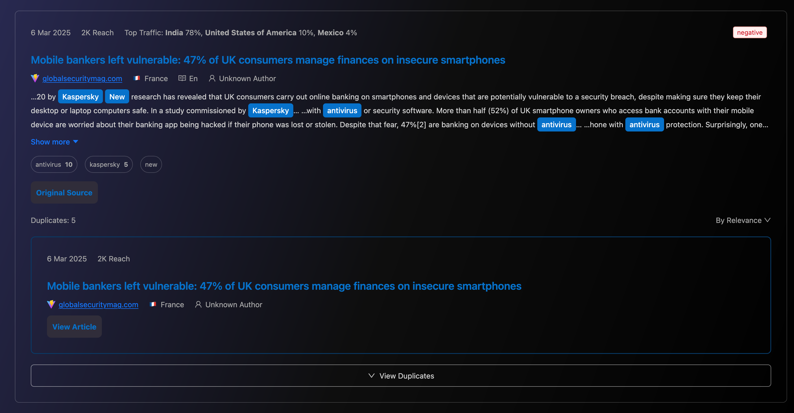
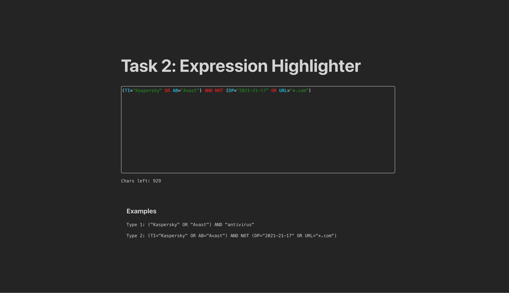

# Task 1
На основе предоставленного скриншота реализовать компонент отображения блока новости.

Технологии: Typescript, SCSS, Mobx, React, Ant Design.

## Setup

Установка: 
```
cd task1
docker-compose up --build
```

После сборки перейти по адресу: `http://localhost:3001`

## Screenshot



# Task 2
Создать компонент HighlightedTextarea, обладающий функционалом Textarea библиотеки Ant Design с подсветкой синтаксиса логических выражений.

Технологии: Typescript, SCSS, React, Ant Design.

## Setup

Установка: 
```
cd task2
docker-compose up --build
```

После сборки перейти по адресу: `http://localhost:3002`

## Screenshot


